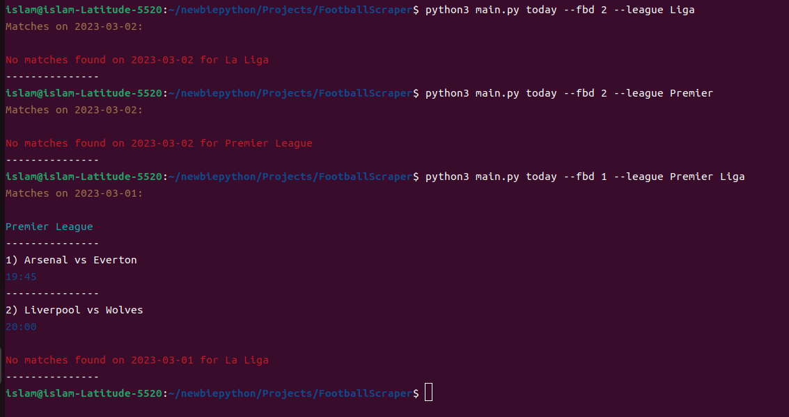

# Futbl-Data-Scraper
## A Command-Line Interface to scrap football data from [fbref](https://fbref.com/en/matches/) and present it by **league**, **country**, or **all**.
## Usage
``` 
usage: main.py [-h] [-l [{Serie,Liga,Ligue,Bundesliga,Premier} ...]] [-c [{Italy,Spain,France,Germany,England} ...]] [--fbd FBD] [-a] [date]

A command line tool to get the results of previous matches and schedules of upcoming matches of all the leagues and cups as foound on fbref.com

positional arguments:
  date                  Date formated as "YY-MM-DD" or "today" or "yesterday" or "tomorrow", in case of no date provided, today's date will be used

options:
  -h, --help            show this help message and exit
  -l [{Serie,Liga,Ligue,Bundesliga,Premier} ...], --league [{Serie,Liga,Ligue,Bundesliga,Premier} ...]
                        a league to display its results, if no league is provided, all the leagues will be displayed
  -c [{Italy,Spain,France,Germany,England} ...], --country [{Italy,Spain,France,Germany,England} ...]
                        a country to display the results of all its leagues and cups (this will overwrite the league)
  --fbd FBD             number of days to go forwards or backwards from the date provided, such that negative numbers will go backwards
  -a, --all             display all the results of all leagues and cups (this will overwrite the league and country)
```
## Features
- Present all the matches played on a date of your choice grouped by their league or country
- Choose to display matches from a specfic legaue ( Available leagues are __Serie A__, __La Liga__, __Ligue 1__, __Bundesliga__, __Premier League__)
- Fetch data after __N__ days from a date by using the option 
``` --fbd N```, if N is negative then new date is in the past, meaning going backwards.
- The timings of the matches are displayed in your local time, thanks to __Selenium__.

## TODO
- Show the status of a given player
- Compare two players 
## CLI in action


